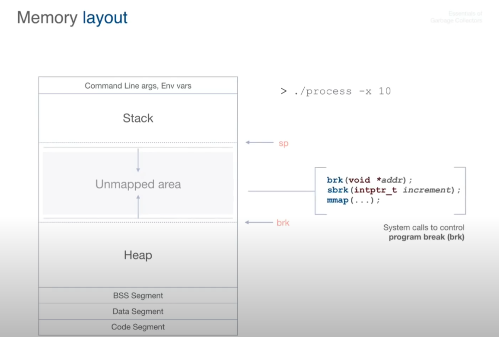

# Notes on memory allocators

### Memory layout

### Pointers

- Only call `requestFromOS` when no free blocks of memory are available in the
  linked list.
- In `allocSize` function, since the `word_t data[1]` already allocates one
  word inside the `MemoryBlock` structure, we decrease it from the size request;
